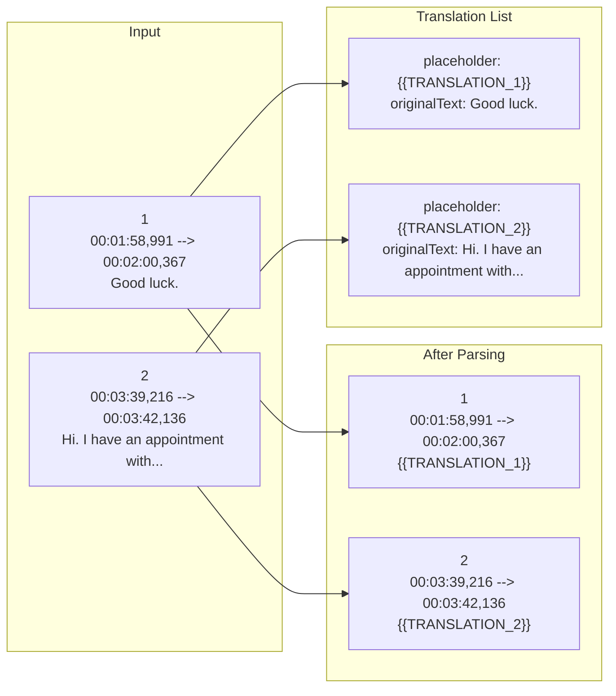
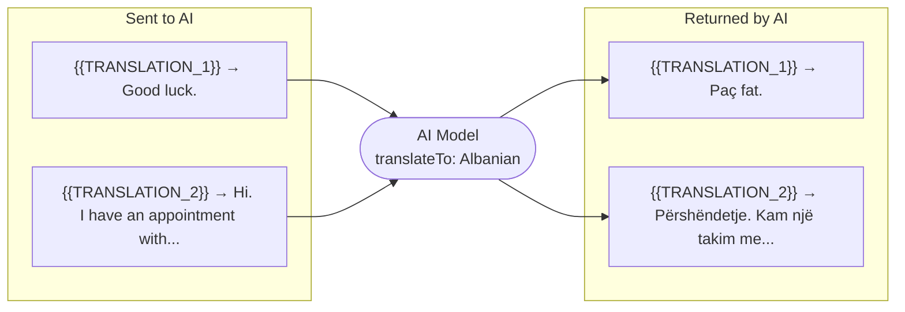
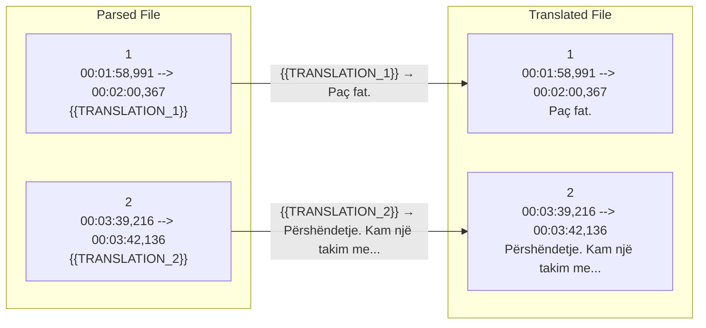

# AI Subtitle Translation Service

## Project Overview

AI Subtitle Translation Service is a web service that accepts subtitle files in the `.srt` format and returns a fully translated version in any target language of your choice, powered by AI.

You upload a subtitle file and specify the target language. The service reads through every subtitle block, extracts the spoken text, sends it to an AI model for translation, and stitches the translated lines back into a properly formatted `.srt` file — preserving timestamps, subtitle numbers, and the overall structure exactly as they were. The translated file is returned as a download, named after the original file with the target language appended.

The translation is done in batches so that even long subtitle files with hundreds of entries are handled reliably, without overwhelming the AI in a single request.

---

## Flow

### 1. Request

The entry point is `TranslationController`, which accepts the `.srt` file and the target language and delegates immediately to the application layer.

```java
// TranslationController.java
@PostMapping(consumes = MediaType.MULTIPART_FORM_DATA_VALUE)
public ResponseEntity<byte[]> translate(
        @RequestParam("file") MultipartFile file,
        @RequestParam("translateTo") String translateTo
) throws IOException {
    String translatedContent = translationApplicationService.translate(file, translateTo);
    // ... build and return the file response
}
```

---

### 2. Save to Filesystem

`TranslationApplicationService` saves the uploaded file to a temporary directory before processing.

```java
// TranslationApplicationService.java
public String translate(MultipartFile file, String targetLanguage) throws IOException {
    Path tempFile = saveToFilesystem(file);
    // ...
}

private Path saveToFilesystem(MultipartFile file) throws IOException {
    Path tempDir = Files.createTempDirectory("subtitle-translations");
    Path destination = tempDir.resolve(file.getOriginalFilename());
    file.transferTo(destination);
    return destination;
}
```

---

### 3. SRT Parsing

The raw file content is handed to `SubtitleFile.parse()`, which walks through every subtitle block, extracts the spoken text, and replaces it with a numbered placeholder — keeping the original text in an ordered `List<TranslationEntry>`.

Given this input:

```
1
00:01:58,991 --> 00:02:00,367
Good luck.

2
00:03:39,216 --> 00:03:42,136
Hi. I have an appointment with...
```

`SubtitleFile.parse()` produces:

```java
// SubtitleFile.java
public static SubtitleFile parse(String originalFileName, String rawContent) {
    // walks lines, detects subtitle number → timestamp → text → empty line
    // for each text block:
    entries.add(new TranslationEntry("{{TRANSLATION_1}}", "Good luck."));
    entries.add(new TranslationEntry("{{TRANSLATION_2}}", "Hi. I have an appointment with..."));
    // replaces text in processedContent with the placeholder
}
```

The file content held in memory becomes:

```
1
00:01:58,991 --> 00:02:00,367
{{TRANSLATION_1}}

2
00:03:39,216 --> 00:03:42,136
{{TRANSLATION_2}}
```

And `entries` is:

```java
record TranslationEntry(String placeholder, String originalText) {}

TranslationEntry("{{TRANSLATION_1}}", "Good luck.")
TranslationEntry("{{TRANSLATION_2}}", "Hi. I have an appointment with...")
```

---

### 4. Batched AI Translation

`TranslationApplicationService` splits `entries` into batches of 20 and calls `AiTranslationClient` for each batch.

```java
// TranslationApplicationService.java
private List<TranslatedEntry> translateInBatches(List<TranslationEntry> entries, String targetLanguage) {
    List<TranslatedEntry> allTranslated = new ArrayList<>();
    for (int i = 0; i < entries.size(); i += BATCH_SIZE) {          // BATCH_SIZE = 20
        List<TranslationEntry> batch = entries.subList(i, Math.min(i + BATCH_SIZE, entries.size()));
        allTranslated.addAll(aiTranslationClient.translate(batch, targetLanguage));
    }
    return allTranslated;
}
```

`SpringAiTranslationClient` sends the batch to the AI and maps the response directly to `List<TranslatedEntry>` via structured output.

```java
// SpringAiTranslationClient.java
public List<TranslatedEntry> translate(List<TranslationEntry> entries, String targetLanguage) {
    return chatClient.prompt()
            .user(buildUserMessage(entries, targetLanguage))
            .call()
            .entity(new ParameterizedTypeReference<List<TranslatedEntry>>() {});
}
```

The AI receives:

```
TranslationEntry("{{TRANSLATION_1}}", "Good luck.")
TranslationEntry("{{TRANSLATION_2}}", "Hi. I have an appointment with...")
```

And returns:

```java
record TranslatedEntry(String placeholder, String translatedText) {}

TranslatedEntry("{{TRANSLATION_1}}", "Paç fat.")
TranslatedEntry("{{TRANSLATION_2}}", "Përshëndetje. Kam një takim me...")
```

---

### 5. Placeholder Replacement

`SubtitleFile.applyTranslations()` iterates the returned entries and replaces each placeholder in the in-memory file content with the translated text.

```java
// SubtitleFile.java
public void applyTranslations(List<TranslatedEntry> translatedEntries) {
    for (TranslatedEntry translated : translatedEntries) {
        content = content.replace(translated.placeholder(), translated.translatedText());
    }
}
```

The file content becomes:

```
1
00:01:58,991 --> 00:02:00,367
Paç fat.

2
00:03:39,216 --> 00:03:42,136
Përshëndetje. Kam një takim me...
```

The temp file is deleted and `TranslationController` returns this content as `movie.Albanian.srt`.

---

### 3. SRT Parsing

Given the following input file:

```
1
00:01:58,991 --> 00:02:00,367
Good luck.

2
00:03:39,216 --> 00:03:42,136
Hi. I have an appointment with...
```

The service reads each subtitle block and replaces the spoken text with a numbered placeholder, while recording the original text for translation:



---

### 4. AI Translation

The extracted entries are sent to the AI in batches. The AI receives the original text and returns the translated text, keeping each placeholder intact.



---

### 5. Placeholder Replacement

Each placeholder in the parsed file is replaced with its corresponding translation:



The final file is returned to the client as `movie.Albanian.srt`.

---

## Running the Service

Set your OpenAI API key, then start the application:

**PowerShell**
```powershell
$env:OPENAI_API_KEY="sk-..."
./mvnw spring-boot:run
```

**CMD**
```cmd
set OPENAI_API_KEY=sk-...
mvnw spring-boot:run
```

Once running, the interactive API documentation is available at:

```
http://localhost:8080/swagger-ui/index.html
```
